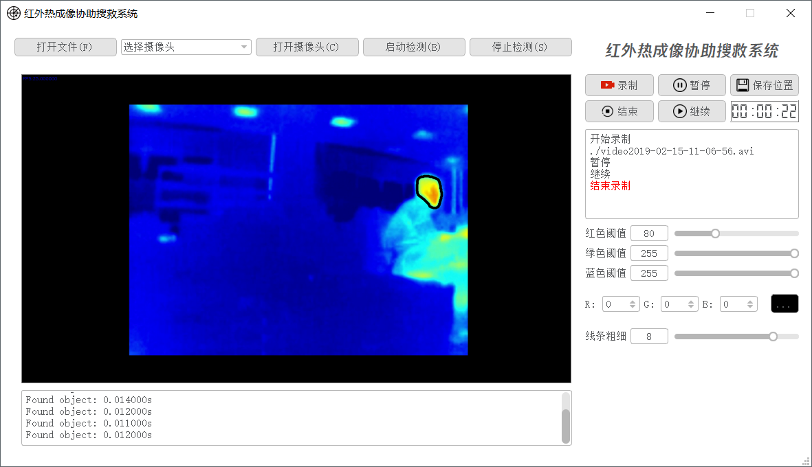

# 红外热成像协助搜救系统

开发环境：

- Windows 10
- OpenCV-3.4.4 MinGW
- CMake 3.9.6
- Qt 5.9.1
- Qt Creator 4.3.1 (Community)

博客连接：[OpenCV-QT项目开发记录](http://blog.sunjiadai.xyz/2019/02/16/OpenCV-QT%E9%A1%B9%E7%9B%AE%E5%BC%80%E5%8F%91%E8%AE%B0%E5%BD%95/)

